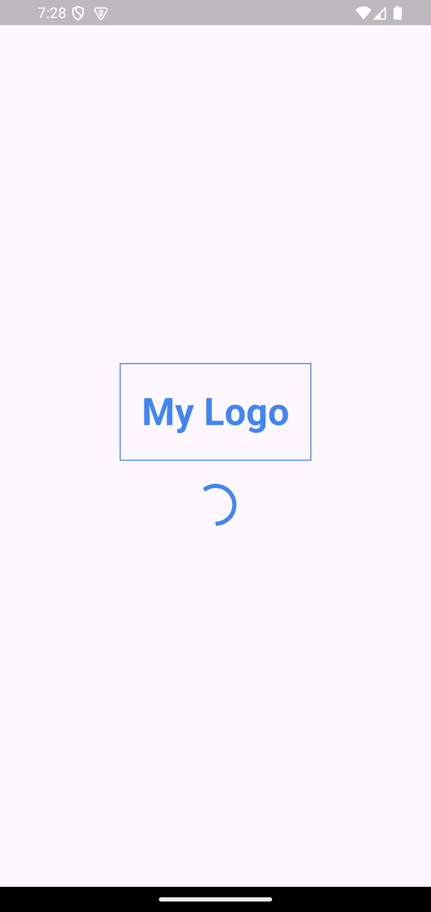
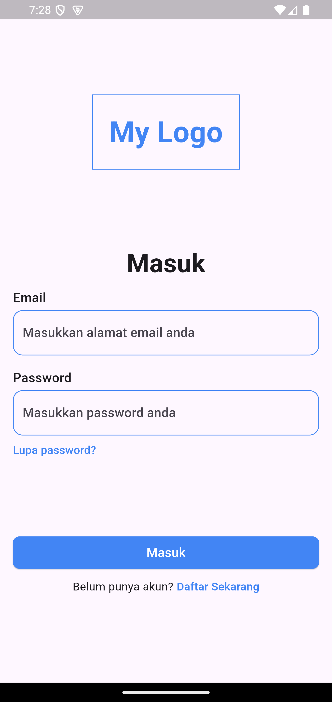
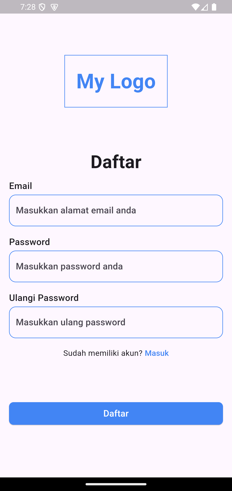
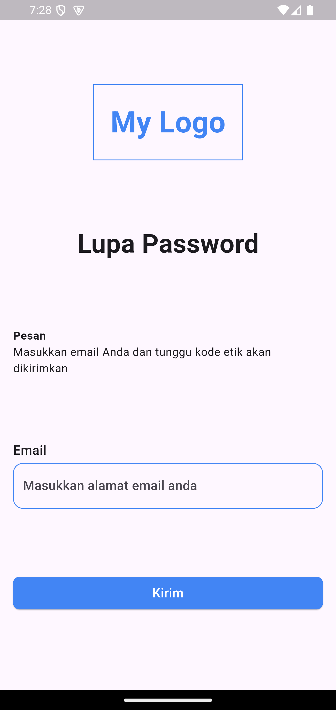
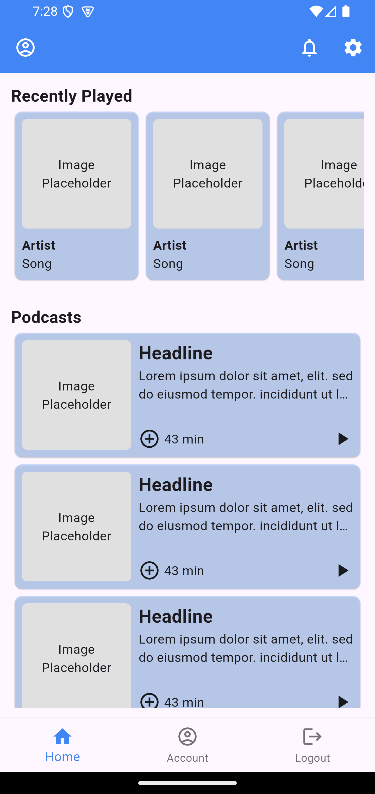
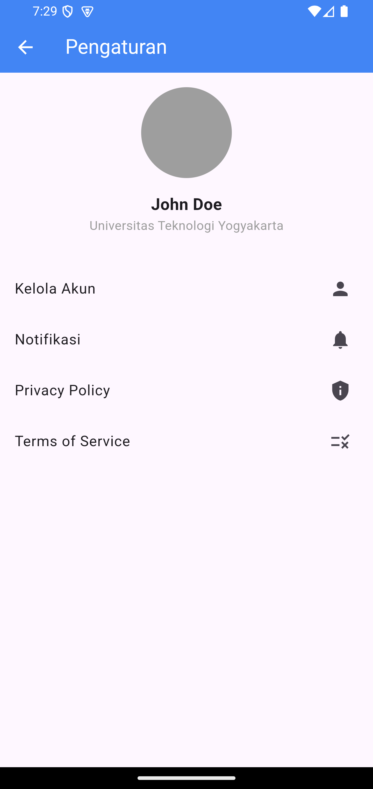
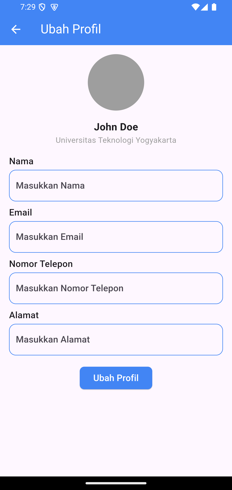

#### Tugas 2 Pengembangan Aplikasi Mobile Lanjut

##### To Run:
1. Download dependencies
```bash
flutter pub get
```

2. Run the app
```bash
flutter run
```


###### Splash Screen
<div align="center">
    <a href="./docs/assets/splash_screen.png">
        
    </a>
</div>

###### Login Screen
<div align="center">
    <a href="./docs/assets/login_screen.png">
        
    </a>
</div>


###### Register Screen
<div align="center">
    <a href="./docs/assets/register_screen.png">
        
    </a>
</div>

###### Forgot Password Screen
<div align="center">
    <a href="./docs/assets/forgot_password_screen.png">
        
    </a>
</div>


###### Home Screen
<div align="center">
    <a href="./docs/assets/home_screen.png">
        
    </a>
</div>


###### Settings Screen
<div align="center">
    <a href="./docs/assets/settings_screen.png">
        
    </a>
</div>


###### Edit Profile Screen
<div align="center">
    <a href="./docs/assets/edit_profile_screen.png">
        
    </a>
</div>
